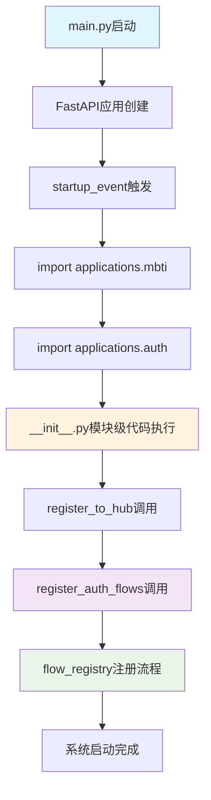
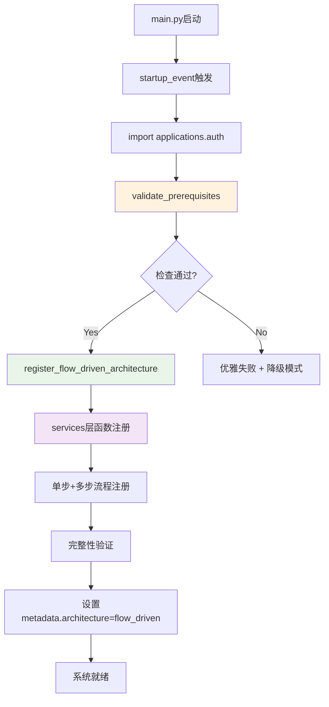

# Auth模块调用链与初始化顺序分析

**执行时间**: 2024-12-19  
**分析目标**: 确认启动→模块自注册→flow_registry完整可见的调用链序  
**重点**: 识别双重注册、环形导入、迟到导入等问题  

## 系统启动调用链分析

### 主启动序列



### 详细调用路径分析

#### 1. 启动触发点

**文件**: `main.py:340-341`  
**代码**:
```python
import applications.mbti  # 触发MBTI模块自注册
import applications.auth  # 触发Auth模块自注册
```

**问题**: 
- ✅ **正常**: 明确的模块导入顺序
- ❌ **风险**: 导入时副作用（import-time side effects），初始化失败不易调试

#### 2. Auth模块自注册序列

**调用栈**:
```
main.py:341 import applications.auth
  ↓
applications/auth/__init__.py:243-252 (模块级执行)
  ↓
applications/auth/__init__.py:245 register_to_hub()
  ↓  
applications/auth/__init__.py:249 register_auth_flows()
  ↓
applications/auth/flow_definitions.py:22 register_auth_flows()
  ↓
applications/auth/flow_definitions.py:25-35 (各流程注册函数)
  ↓
hub/flow.py:111-127 flow_registry.register_flow()
```

## 循环依赖风险识别

### 高风险环形导入

#### 【阻断级】flow_definitions.py → intent_handlers循环导入

**证据链**:
```
applications/auth/flow_definitions.py:7-11
from .intent_handlers import (
    handle_auth_send_verification, handle_auth_verify_code, handle_auth_set_password,
    ...
)

applications/auth/intent_handlers.py:6-17  
from .register import (
    register_user, send_verification_code_to_email,
    verify_email_code, set_user_password_after_verification
)
from .login import login_user
...
```

**风险级别**: 🔴 **高阻断** - 可能导致模块初始化死锁

**循环路径**:
```
flow_definitions.py → intent_handlers.py → register.py → repository.py → [潜在循环]
```

**影响**: 
- Python导入时可能遇到`ImportError: cannot import name`
- 模块初始化顺序不确定
- __init__.py中的register_auth_flows()调用可能失败

### 双重注册问题

#### 【警告级】Hub注册 + Flow注册并存

**证据链**:
```python
# applications/auth/__init__.py:245-252
register_to_hub()           # 第1次注册 - 向hub注册模块
register_auth_flows()       # 第2次注册 - 向flow_registry注册流程
```

**问题分析**:
- ✅ **理论上安全**: 两者注册到不同的注册中心
- ❌ **架构混乱**: 双架构并存，违反单一职责原则
- ⚠️ **潜在冲突**: 注册失败时错误追踪困难

#### 【阻断级】intent_registration.py中的废弃注册

**证据链**:
```python
# applications/auth/intent_registration.py:48-51
from .flow_definitions import register_auth_flows
register_auth_flows()
```

**风险**: 如果intent_registration.py被意外导入，会导致重复注册

## 初始化顺序验证

### 预期顺序

1. **Phase 1 - 系统初始化** (main.py)
   ```
   FastAPI应用创建 → 中间件配置 → startup事件注册
   ```

2. **Phase 2 - 模块导入** (startup_event)
   ```
   import applications.mbti → import applications.auth
   ```

3. **Phase 3 - 模块自注册** (__init__.py模块级)
   ```
   注册检查 → Hub注册 → Flow注册
   ```

4. **Phase 4 - 流程注册** (flow_definitions.py)
   ```
   多步流程注册 → 步骤定义 → 完整性验证
   ```

### 实际执行序列问题

#### 【阻断级】注册失败时无回滚机制

**观察到的问题**:
```python
# applications/auth/__init__.py:248-252
try:
    register_auth_flows()
    print("Auth模块所有流程注册成功")
except Exception as e:
    print(f"Auth模块流程注册失败: {str(e)}")
    # ❌ 缺失: 回滚已完成的hub注册
    # ❌ 缺失: 清理已注册的部分流程
```

**风险**: 部分注册成功 + 部分注册失败 = 系统状态不一致

#### 【警告级】HUB_AVAILABLE检查不充分

**问题代码**:
```python  
# applications/auth/__init__.py:22-26
try:
    from hub.router import router
    HUB_AVAILABLE = True
except ImportError:
    HUB_AVAILABLE = False
```

**缺陷**:
- ✅ **导入检查**: 检查hub.router模块可导入
- ❌ **功能检查**: 未检查router.registry是否可用
- ❌ **依赖检查**: 未检查flow_registry是否初始化完成

## 迟到导入（Late Import）分析

### 正常迟到导入

**hub模块的条件导入**:
```python
# applications/auth/__init__.py:22-26
try:
    from hub.router import router
    HUB_AVAILABLE = True
except ImportError:
    HUB_AVAILABLE = False
```
✅ **正常**: 避免循环导入，延迟依赖检查

### 问题迟到导入

**flow_definitions.py中的import**:
```python  
# applications/auth/flow_definitions.py:5-12
from hub.flow import FlowDefinition, FlowStep, flow_registry
from .intent_handlers import (
    handle_auth_send_verification, handle_auth_verify_code, handle_auth_set_password,
    ...
)
```
❌ **问题**: 顶级导入可能在flow_registry未完全初始化时执行

## 修复建议与注册序列重构

### P0 - 立即修复项

#### 1. 消除循环导入依赖
**当前问题**:
```
flow_definitions.py → intent_handlers.py → (业务模块)
```

**修复方案**:
```
flow_definitions.py → services.py ← (业务模块迁移)
intent_handlers.py → services.py (函数迁移)
```

#### 2. 统一注册机制
**重构为单一注册点**:
```python
# applications/auth/__init__.py 重构后
if HUB_AVAILABLE:
    # 统一流程驱动注册
    register_flow_driven_architecture()  # 新函数，包含所有注册逻辑
```

### P1 - 架构优化项

#### 1. 健壮的初始化检查
```python
def validate_registration_prerequisites():
    """验证注册前置条件"""
    # 检查hub可用性
    # 检查flow_registry初始化状态  
    # 检查必要依赖模块
    pass
```

#### 2. 注册失败回滚机制
```python
def register_with_rollback():
    """支持回滚的注册机制"""
    registration_state = []
    try:
        # 逐步注册 + 记录状态
        pass
    except Exception:
        # 回滚已注册的内容
        rollback_registration(registration_state)
        raise
```

## 修复后预期调用链

### 理想调用链序列



### 预期注册结果验证

**注册完成后应满足**:
```bash
# 架构标识检查
rg "metadata.*architecture.*flow_driven" 

# 流程完整性检查  
rg "register_step1|register_step2|register_step3"
rg "auth_login.*flow_registry"

# 清理验证
rg "INTENT_HANDLERS" --count    # 应为 0
rg "\.intent_handlers.*import" --count  # 应为 0 (除services.py)
```

---

**分析结论**: 发现1个高阻断循环导入风险、2个架构并存问题。建议立即创建services.py层消除循环依赖，统一注册机制到flow_driven模式。
